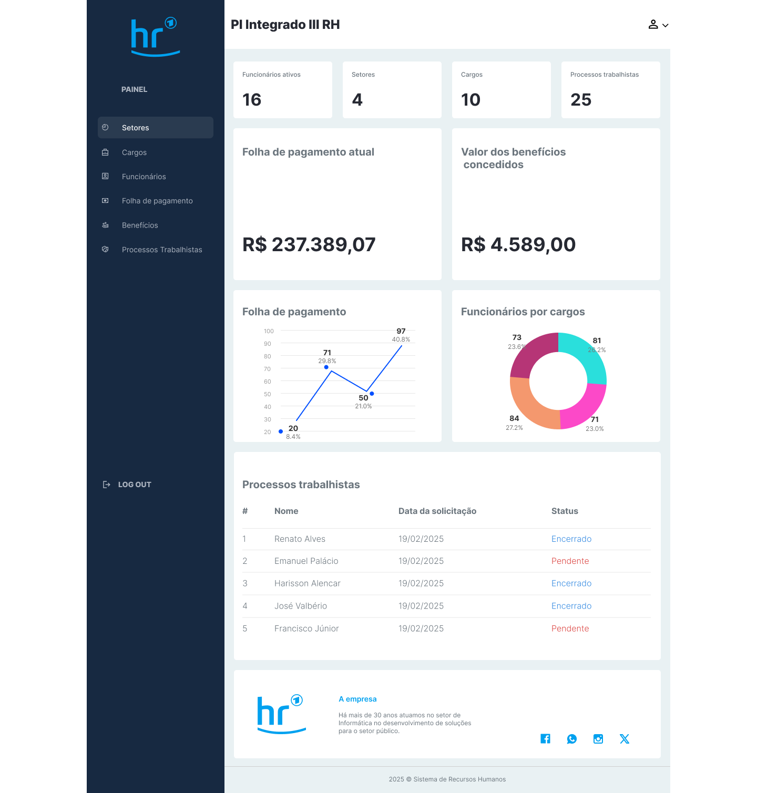
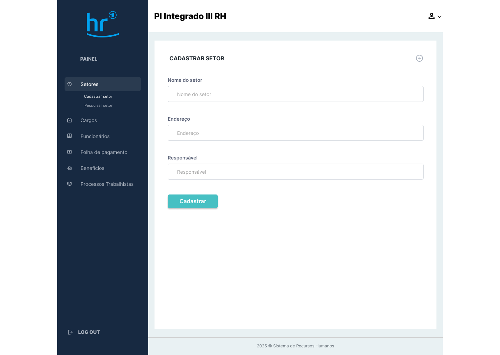
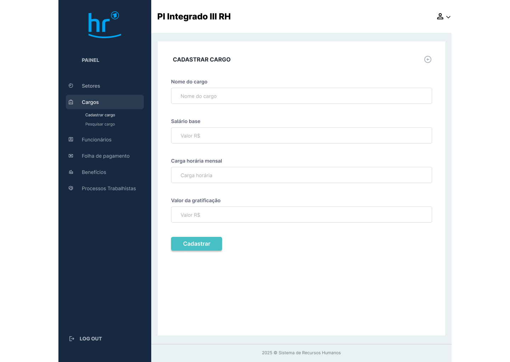
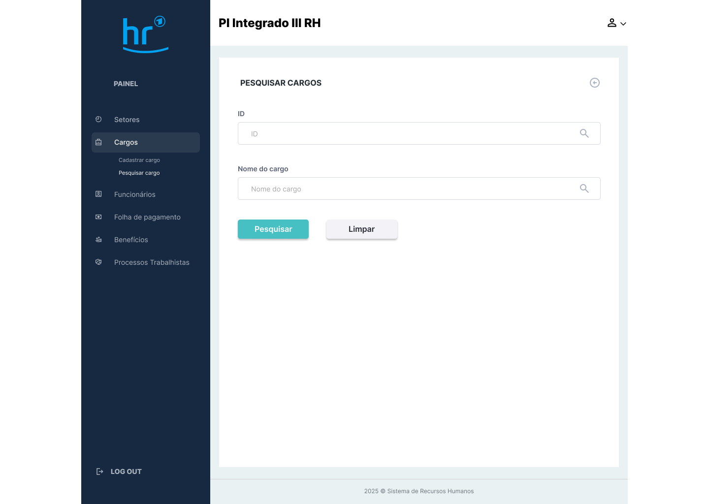
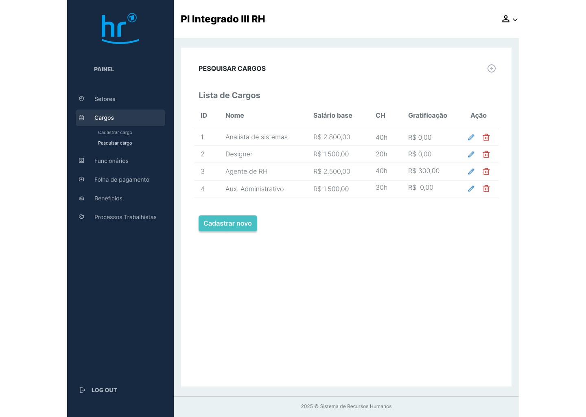
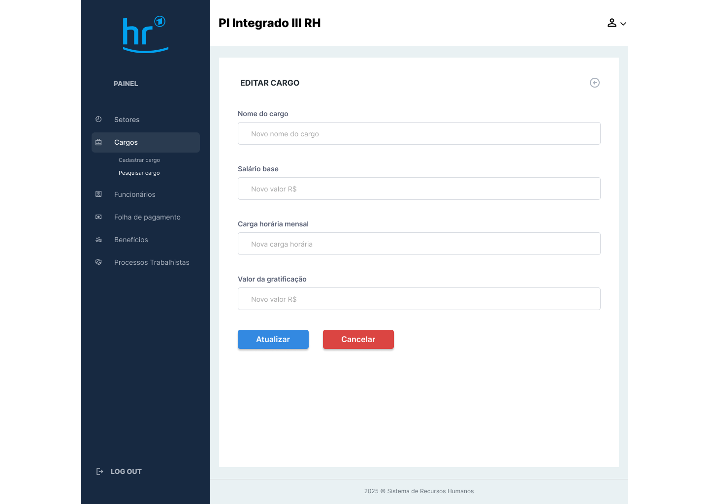

# Protótipo de Alta Fidelidade - Sistema de Recursos Humanos - Projeto Integrado III UFCA

## Este repositório tem como objetivo gerenciar setores, cargos, funcionários e a folha de pagamento de uma empresa de recursos humanos de pequeno porte.

## Sobre o Projeto

O sistema de RH é composto por:
- **Dashboard**: Visão geral com informações da empresa.
- **Gerenciamento de Setores**: Cadastro, edição e exclusão de setores.
- **Gerenciamento Cargos**: Cadastro, edição e exclusão de cargos.
- **Gerenciamento de Funcionários**: Cadastro, edição e exclusão de funcionários.
- **Folha de Pagamento**: Gerenciamento de pagamentos.
- **Benefícios**: Gerenciamento de benefícios.
- **tela de cadastro de usuario**: realização de cadastro de novos usuarios.
- **tela de login**: login do usuario.
- **tela de esqueci sua senha**: destinada a recuperação de acesso ao sistema.

## tecnologias utilizadas
o MVP é composto de HTLM e CSS para estruturação e estilização do sistema, JavaScript para interação do usuario, fetch API para simular comunicação com back-end, com formato de dados em JSON. 

Express e EJS para criar páginas dinâmicas com um front-end modularizado. Para reutilizar componentes e configurar um servidor.

## Protótipo de Alta Fidelidade
O protótipo foi desenvolvido no Figma. Você pode visualizá-lo [aqui](https://www.figma.com/design/J624QdsPAa08a9QNeclkdP/Prot%C3%B3tipo-Preliminar-de-Alta-Fidelidade---RH?node-id=0-1&t=NG6QlhGzwUmRtFVg-1).

### Telas Principais
- **Dashboard**: Visão geral do sistema.
  
- **Setores**: Cadastro e pesquisa de setores.
  
- **Cargos**: Cadastro de cargos.
  
- **Cargos/pesquisa**: Pesquisa de cargos.
  
- **Cargos/pesquisa/lista de cargos**: Lista todos os cargos.
  
- **Cargos/pesquisa/lista de cargos/editar**: Edita o cargo.
  
  
## Pré-requisitos
Antes de começar, certifique-se de ter as seguintes ferramentas instaladas:
- [Node.js](https://nodejs.org/)
- [NPM](https://www.npmjs.com/) (gerenciado pelo Node.js)

## Como Instalar e Rodar o Projeto
1. Clone este repositório:
   ```bash
   https://github.com/renatoalvess/prototype-figma-mvp.git

2. Acesse o diretório do projeto:
   ```bash
   cd prototype-figma-mvp

3. Instale as dependências:
   ```bash
   npm install

4. Inicie o servidor:
   ```bash
   node app.js

5. Acesse no navegador:
   ```bash
   http://localhost:3000

## Como Contribuir como colaborador
1. Faça um fork do projeto.
2. Crie uma branch para sua feature:
   ```bash
   git checkout -b minha-feature

3. Faça as alterações desejadas e commit:
   ```bash
   git commit -m "Adiciona nova feature"

4. Envie suas alterações para o repositório remoto:
   ```bash
   git push origin minha-feature

5. Abra um Pull Request.


##  Instruções sobre o Processo de Integração Contínua (CI)


##  [Componente Extensionista] O que é o Processo de Integração Contínua (CI)?

- Aluno: **Renato Alves**

A integração contínua é responsável por integrar e testar automaticamente alterações no código-fonte de um projeto. 
O bjetivo é indentificar problemas o mais rápido possível, para que possam ser corrigidos de forma eficaz.

As ferramentas realizam várias operações como compilação de código, testes automatizados, análise de código, etc. 
Isso permite entregar um software com maior qualidade e em menos tempo, reduzindo trabalho e custos. 
A integração contínua também facilita a colaboração entre as equipes, acelerando e simplifcando o processo de entrega.

Pra quem está aprendendo a programar é importante tentar entender e aplicar desde cedo, pois ajuda a criar boas práticas,
promove um desenvovlimento mais rápido, seguro, e organizado, evitando grandes problemas futuros.


